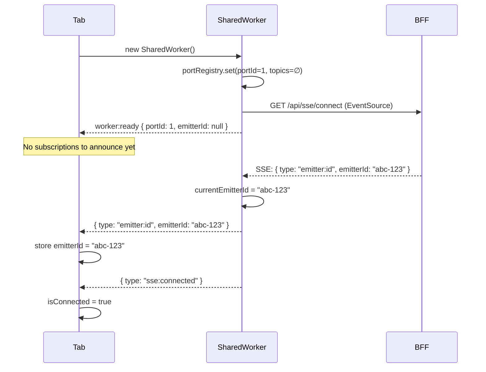
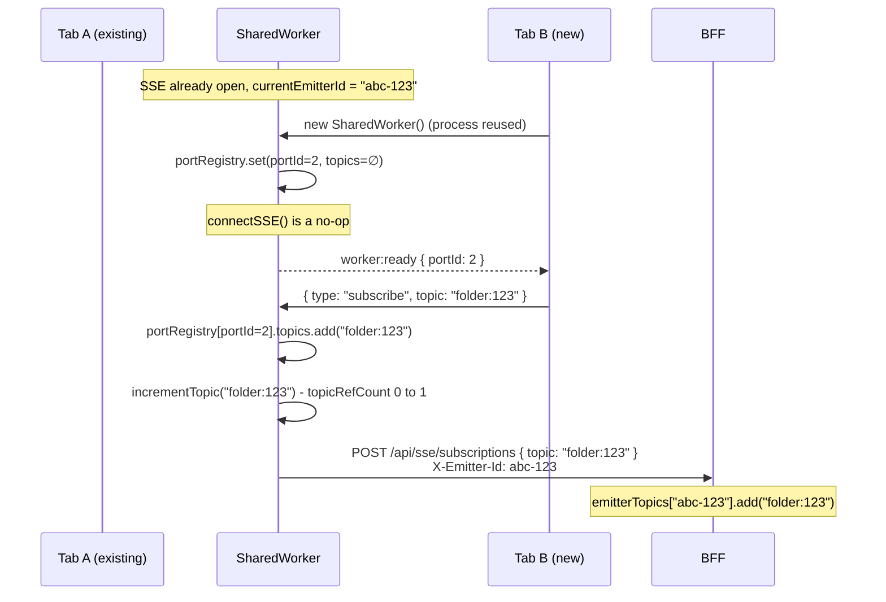
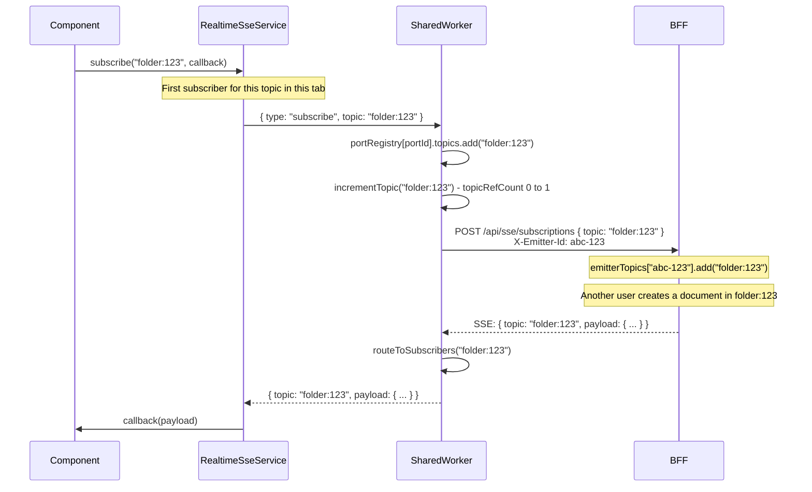
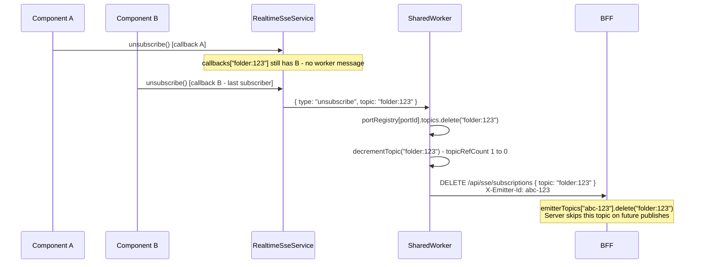
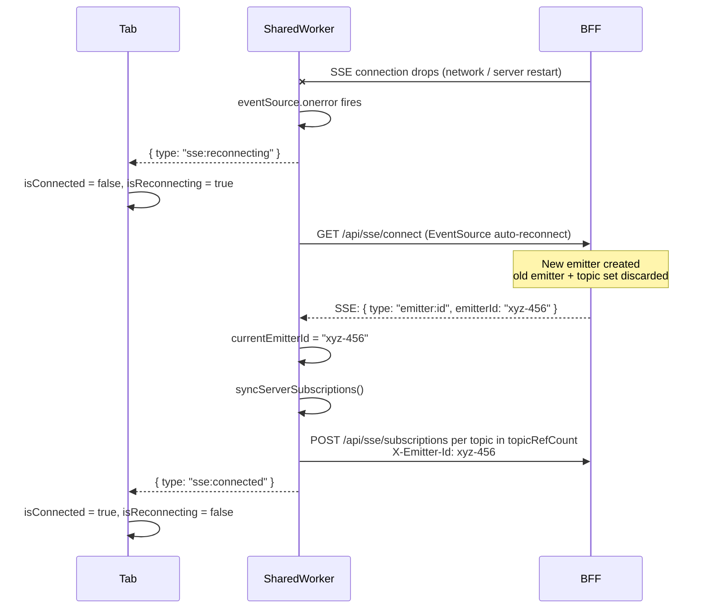
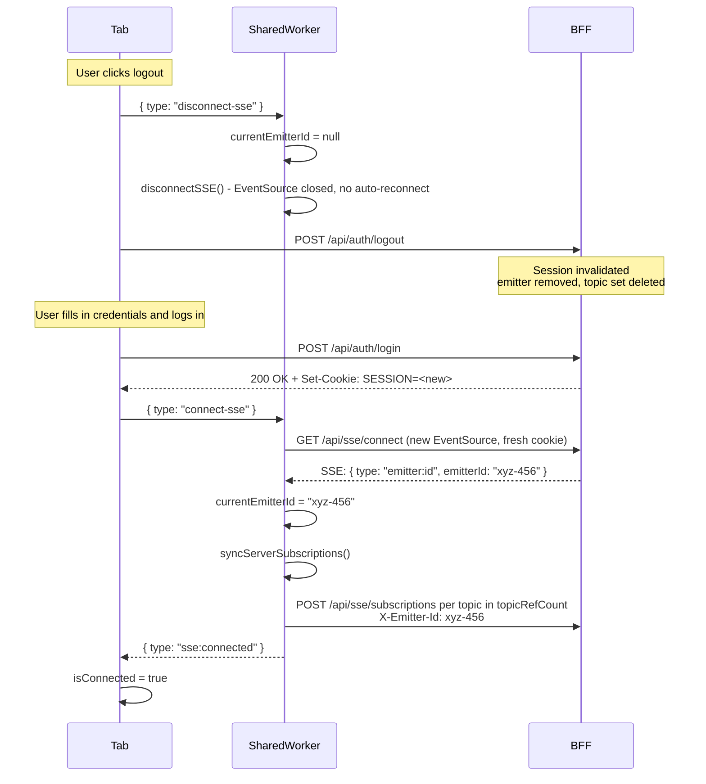
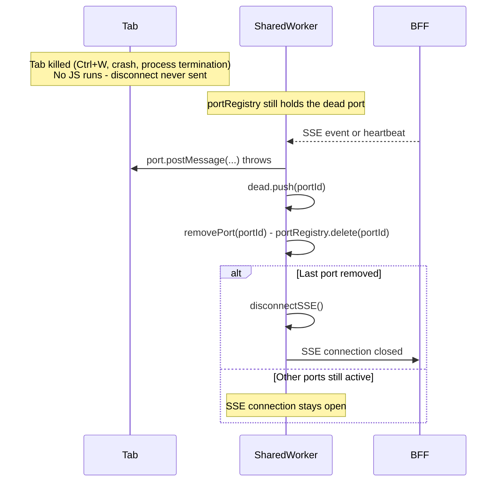

# SSE Sequence Diagrams

Visual representation of all lifecycle scenarios. See `SSE-ARCHITECTURE.md` for detailed
written descriptions.

---

## 1. First Tab - Connection & Emitter ID

No SharedWorker exists yet. The browser spawns a fresh process, opens the SSE connection,
and the server assigns an emitter ID.

---

## 2. Second Tab - Reusing the Existing Worker

The SharedWorker is already running. No new SSE connection is created. The stored
`emitterId` is passed directly in `worker:ready`.

---

## 3. Subscription & Event Delivery

How a component subscribes and receives a routed event end-to-end.

---

## 4. Unsubscribing From a Topic

The last component for a topic unsubscribes. The worker notifies the server only if no other tab is still subscribed.

---

## 5. SSE Connection Drop & Reconnect

Network error or server restart. `EventSource` auto-reconnects, a new emitter is created,
and topics are re-registered with the server.

---

## 6. Logout & Re-login

SSE is closed before session invalidation to prevent a 401 retry loop. A new emitter is
assigned after successful re-authentication.

---

## 7. Hard Tab Close - Dead Port Detection

The tab is killed with no opportunity to run code. The worker discovers the dead port
passively on the next write attempt.

